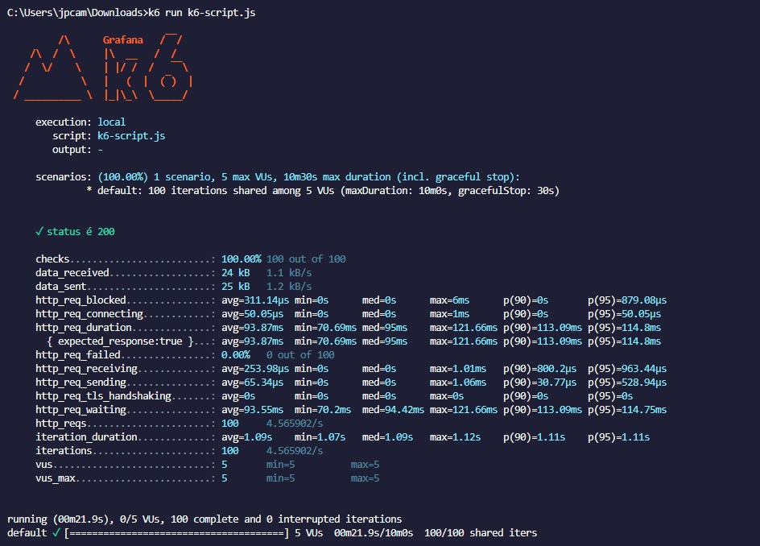
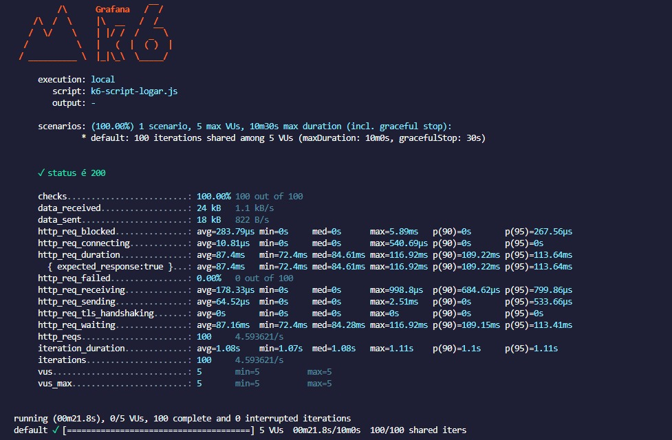

# Sistema de Apoio ao Restaurante Universitario SARU

## MEDIÇÕES DO SLA

### Cadastrar usuário
#### Tipo de operações: leitura / inserção

#### Arquivos envolvidos:

[AuthController](https://github.com/joaocampbell2/Sistema-de-Apoio-ao-Restaurante-Universitario-SARU-/blob/main/saru-rest/src/main/java/saru/saru_rest/controller/AuthController.java)

[AuthService](https://github.com/joaocampbell2/Sistema-de-Apoio-ao-Restaurante-Universitario-SARU-/blob/main/saru-rest/src/main/java/saru/saru_rest/service/auth/AuthService.java)

[AuthServiceImpl](https://github.com/joaocampbell2/Sistema-de-Apoio-ao-Restaurante-Universitario-SARU-/blob/main/saru-rest/src/main/java/saru/saru_rest/service/auth/AuthServiceImpl.java)

[JwtService](https://github.com/joaocampbell2/Sistema-de-Apoio-ao-Restaurante-Universitario-SARU-/blob/main/saru-rest/src/main/java/saru/saru_rest/security/JwtService.java)

[ClienteRepository](https://github.com/joaocampbell2/Sistema-de-Apoio-ao-Restaurante-Universitario-SARU-/blob/main/saru-rest/src/main/java/saru/saru_rest/repository/ClienteRepository.java)

#### Data da medição: 08/01/2025

#### Descrição das configurações: I5 13400F, 16GB RAM, WINDOWS 11

#### Testes de carga (SLA):

### Logar Usuário

#### Tipo de operações: leitura 

#### Arquivos envolvidos:

[AuthController](https://github.com/joaocampbell2/Sistema-de-Apoio-ao-Restaurante-Universitario-SARU-/blob/main/saru-rest/src/main/java/saru/saru_rest/controller/AuthController.java)

[AuthService](https://github.com/joaocampbell2/Sistema-de-Apoio-ao-Restaurante-Universitario-SARU-/blob/main/saru-rest/src/main/java/saru/saru_rest/service/auth/AuthService.java)

[AuthServiceImpl](https://github.com/joaocampbell2/Sistema-de-Apoio-ao-Restaurante-Universitario-SARU-/blob/main/saru-rest/src/main/java/saru/saru_rest/service/auth/AuthServiceImpl.java)

[JwtService](https://github.com/joaocampbell2/Sistema-de-Apoio-ao-Restaurante-Universitario-SARU-/blob/main/saru-rest/src/main/java/saru/saru_rest/security/JwtService.java)

[ClienteRepository](https://github.com/joaocampbell2/Sistema-de-Apoio-ao-Restaurante-Universitario-SARU-/blob/main/saru-rest/src/main/java/saru/saru_rest/repository/ClienteRepository.java)

#### Data da medição: 08/01/2025

#### Descrição das configurações: I5 13400F, 16GB RAM, WINDOWS 11

#### Testes de carga (SLA):

